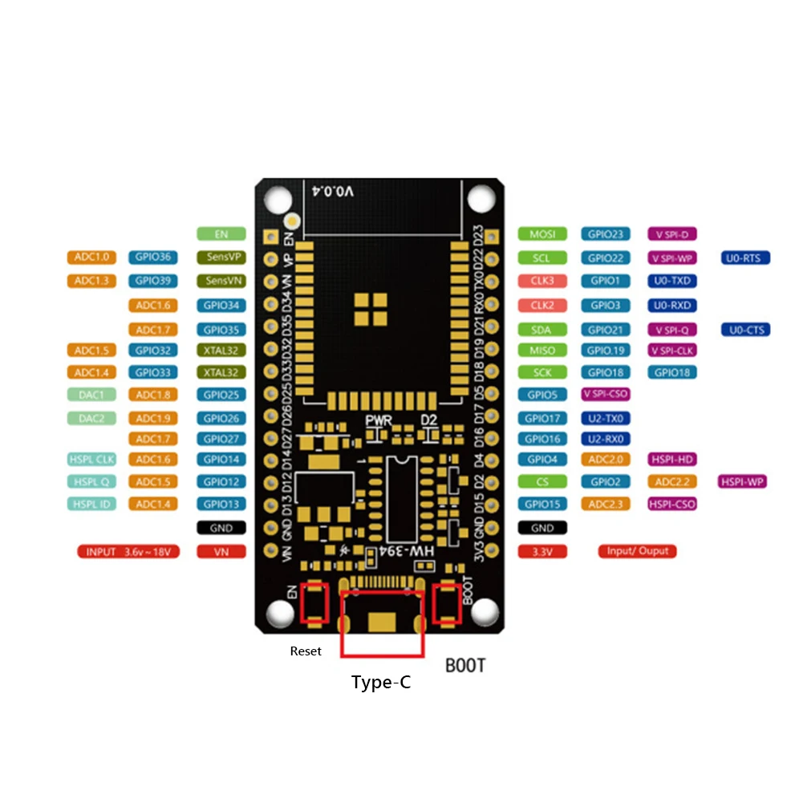

#### remove env.h

# Mini Grow Con**troll**

## ESP-32-WROOM-32D 
*blutooth
*wifi
UART, SPI, SDIO, I2C, PWM, I2S, IR, ADC, DAC

# Testsystem

#### Hardware ESP-32-S 5-12 Volt
- use core NTP to get time and date from ntp server

# RELAY
#### 4-Relais Modul 5V mit Optokoppler Low-Level-Trigger

# PUMP
4 * 1000L/H DC 12V 1,5 A 18Watt

# Peripherals

#### 4 * Time-Of-Flight VL6180X TOF0050C 3-5Volt
###### I2C Hub required
Benewake TFmini-S

- Messbereich: 0 bis über 50 cm
- Auflösung: 1 mm
- FoV: 25°
- Schnittstelle: I2C
- Betriebsspannung:3 V bis 5 V
- Stromaufnahme: Typisch 25 mA während der Messung (Spitzenwert bis zu 40 mA)
- Gewicht: 0,5 g
- Zusätzliche Funktionen: Umgebungslichtsensor mit hohem Dynamikbereich, zwei
programmierbare GPIO-Pins für Interrupt-Ausgaben
- Betriebstemperatur: -20°C bis 70°C

EAN: 4251755810444

# MECHANIC
Gleichstrom
*** C5-Kugelumlaufspindel SFU1605

*** Schneckenradgetriebe mit Encoderscheibe 12 Volt

Linearführung - Rohr 10 x 1,5 mm Leitungsrohr matt V2A
SCS10UU Linearlager für 10mm Wellen

# STORING DATA
### Storing frequently data of system vars
I think it's a god choice use a NAND FLash
https://en.wikipedia.org/wiki/Flash_memory#NAND_flash
SPI Flash SD Karte - XTSD 512MB - NAND Flash Speichermodul - Adafruit 4899 EAN:4060137068195

| Name            | Pieces | Voltage | Amp  | Connect   | GPIO Num |
|-----------------|--------|---------|------|-----------|----------|
| MRD068A Adapter | 1      |         |      |           |          |
| ESP-32-DEV      | 1      | 12      |      |           |          |
| Pump            | 1      | 12      | 1,5  | ov. Relay |          |
| ToF             | 1      | 5       | 0,04 | I2C       | 21,23    |
| NAND Flash      | 1      |         |      | SPI       | 18,19,23 |
| Relay Card      | 1      |         |      | 1 GPIO    | 12       |
| I2C Hub         | 1      |         |      |           |          |
| Lampen Antrieb  | 1      | 12      |      |           |          |

# Discussion
https://www.mikrocontroller.net/topic/578744

